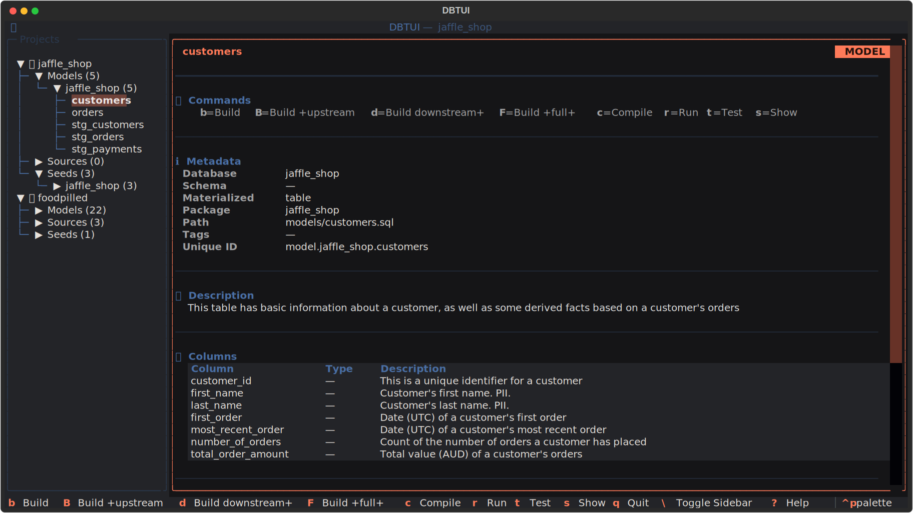

# dbtui


A terminal user interface for [dbt](https://www.getdbt.com/) (data build tool) built with [Textual](https://textual.textualize.io/).

Browse your dbt project's models, sources, and seeds in an interactive TUI. View metadata, SQL, column definitions, and dependencies — then run dbt commands without leaving the terminal.

## Features

- 📁 **Multi-project support** — register and switch between multiple dbt projects
- 🌲 **Tree navigation** — browse models, sources, and seeds grouped by database/schema
- 📝 **Node details** — view metadata, descriptions, columns, dependencies, and SQL
- ⚡ **Run dbt commands** — build, compile, test, run, and show directly from the UI
- 📊 **Data preview** — `dbt show` results rendered in an interactive table
- ⌨️ **Vim-style navigation** — `j/k/h/l/g/G` keybindings throughout
- 💾 **Persistent config** — project registrations saved across sessions

## Installation

```bash
# Clone the repository
git clone https://github.com/YOUR_USERNAME/dbtui.git
cd dbtui

# Install with uv (recommended)
uv pip install -e .

# Or with pip
pip install -e .
```

Requires Python 3.11+ and a working `dbt` installation.

## Quick Start

```bash
# Run from a dbt project directory (auto-detects dbt_project.yml)
dbtui

# Or specify a project path
dbtui --project-path /path/to/your/dbt/project

# Specify a custom dbt binary
dbtui --dbt-path /path/to/dbt
```

> **Note:** You need a compiled manifest (`target/manifest.json`). Run `dbt compile` or `dbt parse` first if you haven't already.

## Keybindings

### Global

| Key | Action |
|-----|--------|
| `q` | Quit |
| `Tab` | Switch pane |
| `\` | Toggle sidebar |
| `1` | Focus sidebar |
| `2` | Focus details |
| `?` | Show help |

### Sidebar (Tree)

| Key | Action |
|-----|--------|
| `j` / `k` | Move cursor down / up |
| `h` | Collapse node or go to parent |
| `l` | Expand node or go to first child |
| `o` | Toggle expand / collapse |
| `Enter` | Select node |
| `g` / `G` | Jump to first / last node |
| `p` | Add project |
| `e` | Edit project |
| `x` | Remove project |

### Node Details

| Key | Action |
|-----|--------|
| `j` / `k` | Scroll down / up |
| `g` / `G` | Scroll to top / bottom |
| `Escape` | Back to sidebar |

### dbt Commands (in Details pane)

| Key | Action |
|-----|--------|
| `b` | Build |
| `B` | Build +upstream |
| `d` | Build downstream+ |
| `F` | Build +full+ |
| `c` | Compile |
| `r` | Run |
| `t` | Test |
| `s` | Show (preview data) |

### Modal Screens

| Key | Action |
|-----|--------|
| `Escape` | Close / Cancel |
| `q` | Close command output |

## Configuration

Project registrations are stored in:

- **Linux**: `$XDG_DATA_HOME/dbtui/projects.json` (default: `~/.local/share/dbtui/`)
- **macOS**: `~/Library/Application Support/dbtui/projects.json`

## Requirements

- Python ≥ 3.11
- A working [dbt](https://docs.getdbt.com/docs/introduction) installation
- A compiled dbt manifest (`target/manifest.json`)

## License

MIT
